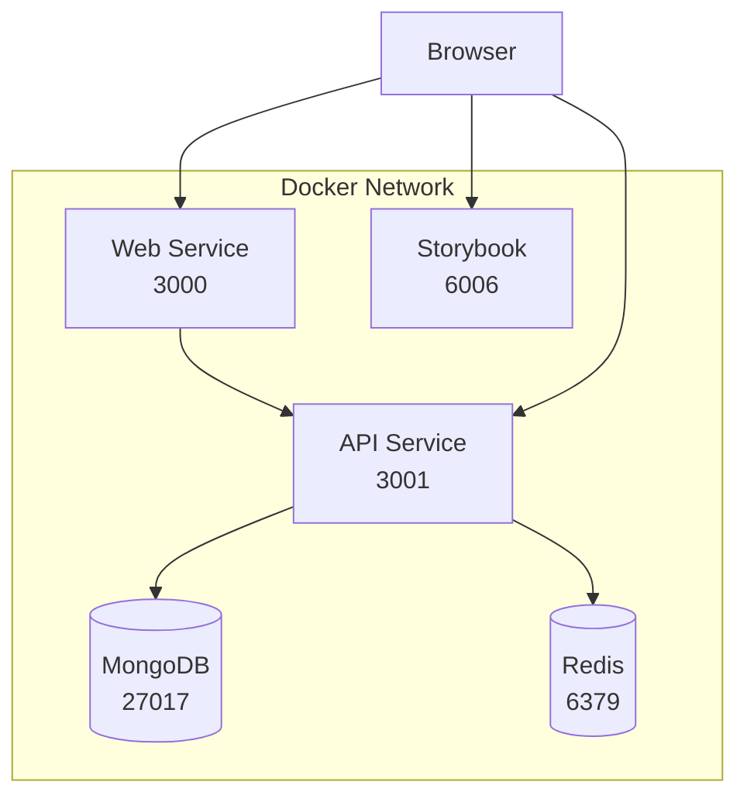

# 🐳 Guía de Inicio con Docker - Alkitu Template

## Requisitos Previos

1. **Docker Desktop** instalado y corriendo
   - Windows: [Descargar Docker Desktop](https://www.docker.com/products/docker-desktop/)
   - Asegúrate de que Docker Desktop esté ejecutándose antes de continuar

2. **Git** (para clonar el repositorio)

## 🚀 Inicio Rápido (Recomendado)

### Opción 1: Usar el Script de Inicio (Windows)

```bash
# Ejecutar con Command Prompt
start-docker.bat

# O con PowerShell
.\start-docker.ps1
```

### Opción 2: Inicio Manual

```bash
# 1. Clonar el repositorio
git clone <tu-repositorio>
cd alkitu-template

# 2. Crear archivo .env
copy .env.template .env

# 3. Instalar dependencias localmente (necesario para generar Prisma)
npm install --legacy-peer-deps

# 4. Generar cliente de Prisma
cd packages/api
npx prisma generate
cd ../..

# 5. Iniciar servicios con Docker
docker-compose -f docker-compose.dev.yml up -d
```

## 📋 Verificar que Todo Funciona

Después de iniciar, verifica que todos los servicios estén corriendo:

```bash
docker ps
```

Deberías ver estos contenedores:
- `alkitu-mongodb-dev` (Puerto 27017)
- `alkitu-redis-dev` (Puerto 6379)
- `alkitu-api-dev` (Puerto 3001)
- `alkitu-web-dev` (Puerto 3000)
- `alkitu-storybook-dev` (Puerto 6006)

## 🌐 URLs de Acceso

- **Frontend**: http://localhost:3000
- **Backend API**: http://localhost:3001
- **API Documentation (Swagger)**: http://localhost:3001/api/docs
- **Storybook**: http://localhost:6006
- **MongoDB**: `mongodb://localhost:27017/alkitu`
- **Redis**: `redis://localhost:6379`

## 🛠️ Comandos Útiles

```bash
# Ver logs de todos los servicios
docker-compose -f docker-compose.dev.yml logs -f

# Ver logs de un servicio específico
docker-compose -f docker-compose.dev.yml logs -f api

# Detener todos los servicios
docker-compose -f docker-compose.dev.yml down

# Reiniciar un servicio
docker-compose -f docker-compose.dev.yml restart api

# Reconstruir imágenes
docker-compose -f docker-compose.dev.yml build --no-cache

# Ejecutar comandos en un contenedor
docker exec -it alkitu-api-dev sh
```

## 🔧 Solución de Problemas

### Error: "Port already in use"

Si obtienes un error de puerto en uso:

```bash
# Windows - Buscar proceso usando el puerto
netstat -ano | findstr :3000
netstat -ano | findstr :3001

# Terminar el proceso (reemplaza PID con el número encontrado)
taskkill //PID <numero> //F
```

### Error: "Cannot connect to MongoDB"

1. Verifica que MongoDB esté corriendo:
   ```bash
   docker logs alkitu-mongodb-dev
   ```

2. Verifica el replica set:
   ```bash
   docker exec alkitu-mongodb-dev mongosh --eval "rs.status()"
   ```

### Error: "Prisma Client not generated"

```bash
cd packages/api
npx prisma generate
cd ../..
docker-compose -f docker-compose.dev.yml restart api
```

## 🔄 Desarrollo con Hot Reload

Los contenedores están configurados con volúmenes para hot reload:

- **Frontend (Next.js)**: Los cambios en `/packages/web/src` se reflejan automáticamente
- **Backend (NestJS)**: Los cambios en `/packages/api/src` se reflejan automáticamente

## 📦 Estructura de Docker

```
alkitu-template/
├── docker-compose.dev.yml      # Configuración principal
├── infrastructure/
│   └── docker/
│       ├── api.dev.Dockerfile  # Dockerfile para API (desarrollo)
│       ├── web.dev.Dockerfile  # Dockerfile para Web (desarrollo)
│       └── ...                 # Otros Dockerfiles
└── packages/
    ├── api/                    # Backend NestJS
    └── web/                    # Frontend Next.js
```

## 🏗️ Arquitectura



## 🚨 Importante

- **Nunca** commitees el archivo `.env` con credenciales reales
- Los Dockerfiles de desarrollo (`*.dev.Dockerfile`) no son para producción
- Para producción, usa los Dockerfiles optimizados en `/infrastructure/docker/`

## 📝 Notas Adicionales

- El proyecto usa **MongoDB con Replica Set** para soportar transacciones de Prisma
- Redis se usa para caché y gestión de sesiones
- Los volúmenes de Docker persisten los datos entre reinicios
- El hot reload está habilitado para desarrollo rápido