# 🏆 Buenas Prácticas para Agentes de Desarrollo

## 📋 **Principios Fundamentales**

### 🔥 **SOLID Principles - Aplicación Obligatoria**

Todos los agentes deben seguir estrictamente los principios SOLID en cada implementación:

#### **S - Single Responsibility Principle**

```typescript
// ❌ INCORRECTO - Clase con múltiples responsabilidades
class UserService {
  createUser(userData: any) {
    /* ... */
  }
  sendEmail(email: string) {
    /* ... */
  }
  validatePayment(paymentData: any) {
    /* ... */
  }
  generateReport() {
    /* ... */
  }
}

// ✅ CORRECTO - Separación de responsabilidades
class UserService {
  constructor(
    private emailService: EmailService,
    private paymentService: PaymentService,
    private reportService: ReportService
  ) {}

  async createUser(userData: CreateUserDto): Promise<User> {
    // Solo lógica de creación de usuario
    const user = await this.repository.create(userData);
    await this.emailService.sendWelcomeEmail(user.email);
    return user;
  }
}

class EmailService {
  async sendWelcomeEmail(email: string): Promise<void> {
    // Solo lógica de envío de emails
  }
}
```

#### **O - Open/Closed Principle**

```typescript
// ✅ CORRECTO - Extensible sin modificar código existente
interface PaymentProcessor {
  process(amount: number): Promise<PaymentResult>;
}

class StripePaymentProcessor implements PaymentProcessor {
  async process(amount: number): Promise<PaymentResult> {
    // Implementación específica de Stripe
  }
}

class PayPalPaymentProcessor implements PaymentProcessor {
  async process(amount: number): Promise<PaymentResult> {
    // Implementación específica de PayPal
  }
}

class PaymentService {
  constructor(private processor: PaymentProcessor) {}

  async processPayment(amount: number): Promise<PaymentResult> {
    return this.processor.process(amount);
  }
}
```

#### **L - Liskov Substitution Principle**

```typescript
// ✅ CORRECTO - Subclases pueden sustituir a la clase base
abstract class DatabaseRepository<T> {
  abstract create(data: T): Promise<T>;
  abstract findById(id: string): Promise<T | null>;
  abstract update(id: string, data: Partial<T>): Promise<T>;
  abstract delete(id: string): Promise<void>;
}

class MongoUserRepository extends DatabaseRepository<User> {
  async create(data: User): Promise<User> {
    // Implementación específica de MongoDB
  }
  // ... otros métodos
}

class PostgresUserRepository extends DatabaseRepository<User> {
  async create(data: User): Promise<User> {
    // Implementación específica de PostgreSQL
  }
  // ... otros métodos
}
```

#### **I - Interface Segregation Principle**

```typescript
// ❌ INCORRECTO - Interfaz muy grande
interface UserOperations {
  create(data: any): Promise<User>;
  update(id: string, data: any): Promise<User>;
  delete(id: string): Promise<void>;
  sendEmail(email: string): Promise<void>;
  processPayment(amount: number): Promise<void>;
  generateReport(): Promise<string>;
}

// ✅ CORRECTO - Interfaces específicas
interface UserRepository {
  create(data: CreateUserDto): Promise<User>;
  update(id: string, data: UpdateUserDto): Promise<User>;
  delete(id: string): Promise<void>;
  findById(id: string): Promise<User | null>;
}

interface NotificationService {
  sendEmail(email: string, template: string): Promise<void>;
  sendSMS(phone: string, message: string): Promise<void>;
}

interface PaymentService {
  processPayment(amount: number, method: string): Promise<PaymentResult>;
}
```

#### **D - Dependency Inversion Principle**

```typescript
// ✅ CORRECTO - Depender de abstracciones, no de concreciones
interface ILogger {
  log(message: string): void;
  error(message: string): void;
}

interface IEmailService {
  sendEmail(to: string, subject: string, body: string): Promise<void>;
}

class UserService {
  constructor(
    private logger: ILogger,
    private emailService: IEmailService,
    private userRepository: IUserRepository
  ) {}

  async createUser(userData: CreateUserDto): Promise<User> {
    this.logger.log(`Creating user: ${userData.email}`);

    try {
      const user = await this.userRepository.create(userData);
      await this.emailService.sendEmail(
        user.email,
        "Welcome!",
        "Welcome to our platform"
      );
      return user;
    } catch (error) {
      this.logger.error(`Error creating user: ${error.message}`);
      throw error;
    }
  }
}
```

### 📝 **Comentarios Profesionales - Estándar Obligatorio**

#### **Documentación de Clases y Métodos**

````typescript
/**
 * Servicio responsable de la gestión de usuarios del sistema.
 *
 * Maneja operaciones CRUD de usuarios, incluyendo validación,
 * autenticación y notificaciones relacionadas.
 *
 * @example
 * ```typescript
 * const userService = new UserService(logger, emailService, repository);
 * const user = await userService.createUser({
 *   email: 'user@example.com',
 *   name: 'John Doe',
 *   role: UserRole.USER
 * });
 * ```
 */
export class UserService {
  constructor(
    private readonly logger: ILogger,
    private readonly emailService: IEmailService,
    private readonly userRepository: IUserRepository
  ) {}

  /**
   * Crea un nuevo usuario en el sistema.
   *
   * @param userData - Datos del usuario a crear
   * @returns Promise que resuelve con el usuario creado
   * @throws {ValidationError} Cuando los datos no son válidos
   * @throws {ConflictError} Cuando el email ya existe
   *
   * @example
   * ```typescript
   * const user = await userService.createUser({
   *   email: 'test@example.com',
   *   name: 'Test User',
   *   role: UserRole.USER
   * });
   * ```
   */
  async createUser(userData: CreateUserDto): Promise<User> {
    // Validar datos de entrada
    await this.validateUserData(userData);

    // Verificar si el usuario ya existe
    const existingUser = await this.userRepository.findByEmail(userData.email);
    if (existingUser) {
      throw new ConflictError("User already exists");
    }

    // Crear usuario con datos validados
    const user = await this.userRepository.create(userData);

    // Enviar email de bienvenida de forma asíncrona
    this.emailService.sendWelcomeEmail(user.email).catch((error) => {
      this.logger.error(`Failed to send welcome email: ${error.message}`);
    });

    this.logger.log(`User created successfully: ${user.id}`);
    return user;
  }
}
````

#### **Comentarios Inline para Lógica Compleja**

```typescript
async function processPayment(paymentData: PaymentDto): Promise<PaymentResult> {
  // Calcular el monto total incluyendo impuestos y tarifas
  const totalAmount = calculateTotalAmount(paymentData);

  // Validar límites de transacción según el tipo de usuario
  await validateTransactionLimits(paymentData.userId, totalAmount);

  try {
    // Procesar pago con el procesador seleccionado
    const result = await paymentProcessor.process({
      amount: totalAmount,
      currency: paymentData.currency,
      method: paymentData.method,
    });

    // Si el pago es exitoso, actualizar el estado del pedido
    if (result.status === "success") {
      await orderService.updateStatus(paymentData.orderId, "paid");

      // Programar entrega del producto de forma asíncrona
      await scheduleProductDelivery(paymentData.orderId);
    }

    return result;
  } catch (error) {
    // Registrar error para análisis posterior
    logger.error(`Payment processing failed: ${error.message}`, {
      userId: paymentData.userId,
      orderId: paymentData.orderId,
      amount: totalAmount,
    });

    throw new PaymentProcessingError("Payment failed", error);
  }
}
```

### 🔒 **Validaciones Zod - Implementación Obligatoria**

#### **Schemas de Validación Completos**

```typescript
import { z } from "zod";

/**
 * Schema de validación para creación de usuarios.
 * Incluye todas las validaciones de negocio necesarias.
 */
export const CreateUserSchema = z.object({
  email: z
    .string()
    .email("Email debe tener formato válido")
    .min(5, "Email debe tener al menos 5 caracteres")
    .max(255, "Email no puede exceder 255 caracteres")
    .transform((email) => email.toLowerCase().trim()),

  name: z
    .string()
    .min(2, "Nombre debe tener al menos 2 caracteres")
    .max(100, "Nombre no puede exceder 100 caracteres")
    .regex(/^[a-zA-ZÀ-ÿ\s]+$/, "Nombre solo puede contener letras y espacios")
    .transform((name) => name.trim()),

  password: z
    .string()
    .min(8, "Contraseña debe tener al menos 8 caracteres")
    .max(128, "Contraseña no puede exceder 128 caracteres")
    .regex(
      /^(?=.*[a-z])(?=.*[A-Z])(?=.*\d)(?=.*[@$!%*?&])[A-Za-z\d@$!%*?&]/,
      "Contraseña debe contener al menos: 1 minúscula, 1 mayúscula, 1 número y 1 carácter especial"
    ),

  role: z
    .nativeEnum(UserRole, {
      errorMap: () => ({
        message: "Rol debe ser uno de los valores permitidos",
      }),
    })
    .default(UserRole.USER),

  birthDate: z
    .string()
    .datetime("Fecha debe estar en formato ISO 8601")
    .transform((date) => new Date(date))
    .refine((date) => {
      const age = new Date().getFullYear() - date.getFullYear();
      return age >= 18 && age <= 120;
    }, "Usuario debe tener entre 18 y 120 años"),

  preferences: z
    .object({
      notifications: z.boolean().default(true),
      newsletter: z.boolean().default(false),
      theme: z.enum(["light", "dark", "auto"]).default("auto"),
    })
    .optional(),
});

export type CreateUserDto = z.infer<typeof CreateUserSchema>;

/**
 * Schema de validación para actualización de usuarios.
 * Todos los campos son opcionales excepto validaciones específicas.
 */
export const UpdateUserSchema = CreateUserSchema.partial()
  .omit({
    email: true, // Email no se puede cambiar
  })
  .extend({
    id: z.string().cuid("ID debe ser un CUID válido"),
  });

export type UpdateUserDto = z.infer<typeof UpdateUserSchema>;
```

#### **Middleware de Validación**

```typescript
import { z } from "zod";
import { Request, Response, NextFunction } from "express";

/**
 * Middleware para validar datos de entrada usando schemas de Zod.
 *
 * @param schema - Schema de Zod para validar
 * @param source - Fuente de los datos ('body', 'params', 'query')
 * @returns Middleware de Express que valida los datos
 */
export function validateSchema<T>(
  schema: z.ZodSchema<T>,
  source: "body" | "params" | "query" = "body"
) {
  return (req: Request, res: Response, next: NextFunction) => {
    try {
      const data = req[source];

      // Validar y transformar datos
      const validatedData = schema.parse(data);

      // Reemplazar datos originales con datos validados
      req[source] = validatedData;

      next();
    } catch (error) {
      if (error instanceof z.ZodError) {
        // Formatear errores de validación de forma user-friendly
        const formattedErrors = error.errors.map((err) => ({
          field: err.path.join("."),
          message: err.message,
          code: err.code,
        }));

        return res.status(400).json({
          error: "Validation Error",
          details: formattedErrors,
        });
      }

      // Error inesperado
      console.error("Unexpected validation error:", error);
      return res.status(500).json({
        error: "Internal Server Error",
      });
    }
  };
}

// Uso en controladores
app.post(
  "/users",
  validateSchema(CreateUserSchema, "body"),
  async (req, res) => {
    // req.body ya está validado y tipado
    const userData = req.body as CreateUserDto;
    const user = await userService.createUser(userData);
    res.json(user);
  }
);
```

### 🔗 **Validación de Conexiones API - Protocolo Obligatorio**

#### **Verificación de Endpoints Next.js ↔ NestJS**

```typescript
/**
 * Utility para verificar que los endpoints de Next.js
 * coincidan con los endpoints de NestJS.
 */
export class APIConnectionValidator {
  private nextjsRoutes: APIRoute[] = [];
  private nestjsRoutes: APIRoute[] = [];

  /**
   * Extrae rutas de archivos API de Next.js
   */
  async extractNextjsRoutes(): Promise<APIRoute[]> {
    const routeFiles = await glob("pages/api/**/*.ts");

    return routeFiles.map((file) => {
      const route = file.replace("pages/api/", "").replace(".ts", "");
      const methods = this.extractMethodsFromFile(file);

      return {
        path: `/api/${route}`,
        methods,
        file,
      };
    });
  }

  /**
   * Extrae rutas de controladores de NestJS
   */
  async extractNestjsRoutes(): Promise<APIRoute[]> {
    const controllerFiles = await glob("src/**/*.controller.ts");

    const routes: APIRoute[] = [];

    for (const file of controllerFiles) {
      const content = await fs.readFile(file, "utf-8");
      const routeData = this.parseNestjsController(content);
      routes.push(...routeData);
    }

    return routes;
  }

  /**
   * Valida que todas las rutas de Next.js tengan correspondencia en NestJS
   */
  async validateConnections(): Promise<ValidationResult> {
    const nextjsRoutes = await this.extractNextjsRoutes();
    const nestjsRoutes = await this.extractNestjsRoutes();

    const missingInNestjs = nextjsRoutes.filter(
      (nextRoute) =>
        !nestjsRoutes.some((nestRoute) =>
          this.routesMatch(nextRoute, nestRoute)
        )
    );

    const missingInNextjs = nestjsRoutes.filter(
      (nestRoute) =>
        !nextjsRoutes.some((nextRoute) =>
          this.routesMatch(nextRoute, nestRoute)
        )
    );

    return {
      isValid: missingInNestjs.length === 0 && missingInNextjs.length === 0,
      missingInNestjs,
      missingInNextjs,
      report: this.generateReport(missingInNestjs, missingInNextjs),
    };
  }

  /**
   * Genera reporte detallado de discrepancias
   */
  private generateReport(
    missingInNestjs: APIRoute[],
    missingInNextjs: APIRoute[]
  ): string {
    let report = "# API Connection Validation Report\n\n";

    if (missingInNestjs.length > 0) {
      report += "## ⚠️ Missing in NestJS Backend:\n";
      missingInNestjs.forEach((route) => {
        report += `- ${route.methods.join(", ")} ${route.path}\n`;
      });
      report += "\n";
    }

    if (missingInNextjs.length > 0) {
      report += "## ⚠️ Missing in Next.js Frontend:\n";
      missingInNextjs.forEach((route) => {
        report += `- ${route.methods.join(", ")} ${route.path}\n`;
      });
      report += "\n";
    }

    if (missingInNestjs.length === 0 && missingInNextjs.length === 0) {
      report += "## ✅ All API connections are valid!\n";
    }

    return report;
  }
}

// Test de integración automático
describe("API Connection Validation", () => {
  it("should have matching routes between Next.js and NestJS", async () => {
    const validator = new APIConnectionValidator();
    const result = await validator.validateConnections();

    if (!result.isValid) {
      console.log(result.report);
    }

    expect(result.isValid).toBe(true);
  });
});
```

## 🧪 **Estrategias de Testing - Protocolo del Test Agent**

### **Responsabilidades del Test Agent**

#### **1. Evaluación Continua de Tests**

```typescript
/**
 * El Test Agent debe evaluar constantemente si los tests necesitan actualización
 * basándose en estos criterios:
 */
interface TestEvaluationCriteria {
  // Criterios para actualizar tests
  codeChangeImpact: "high" | "medium" | "low";
  coverageDecreased: boolean;
  newFunctionalityAdded: boolean;
  businessLogicChanged: boolean;

  // Criterios para refactorizar tests
  testsAreFlaky: boolean;
  testMaintenanceCost: "high" | "medium" | "low";
  testExecutionTime: number; // en milisegundos
  testComplexity: "high" | "medium" | "low";
}

/**
 * Protocolo de decisión para tests
 */
class TestDecisionProtocol {
  /**
   * Evalúa si se deben actualizar los tests o crear ticket de refactoring
   */
  evaluateTestAction(criteria: TestEvaluationCriteria): TestAction {
    // Casos que requieren actualización inmediata
    if (
      criteria.codeChangeImpact === "high" ||
      criteria.coverageDecreased ||
      criteria.newFunctionalityAdded
    ) {
      return {
        action: "update_tests",
        priority: "high",
        reason: "Critical functionality changed",
      };
    }

    // Casos que requieren refactoring
    if (
      criteria.testsAreFlaky ||
      criteria.testMaintenanceCost === "high" ||
      criteria.testExecutionTime > 5000
    ) {
      return {
        action: "create_refactoring_ticket",
        priority: "medium",
        reason: "Test quality needs improvement",
      };
    }

    // Casos de actualización opcional
    if (criteria.businessLogicChanged) {
      return {
        action: "update_tests",
        priority: "low",
        reason: "Business logic alignment",
      };
    }

    return {
      action: "no_action",
      priority: "none",
      reason: "Tests are adequate",
    };
  }
}
```

#### **2. Evaluación de Impacto Gradual**

```typescript
/**
 * Estrategia para evaluar el impacto de cambios en tests
 * y implementar mejoras de forma gradual
 */
class GradualTestImprovementStrategy {
  /**
   * Evalúa el impacto de cambios en el sistema de tests
   */
  async evaluateTestImpact(changes: CodeChange[]): Promise<TestImpactAnalysis> {
    const analysis: TestImpactAnalysis = {
      affectedTests: [],
      riskLevel: "low",
      requiredActions: [],
      migrationPath: [],
    };

    for (const change of changes) {
      // Análisis de archivos afectados
      const affectedFiles = await this.findAffectedTestFiles(change);
      analysis.affectedTests.push(...affectedFiles);

      // Evaluación de riesgo
      const riskLevel = this.calculateRiskLevel(change);
      if (riskLevel > analysis.riskLevel) {
        analysis.riskLevel = riskLevel;
      }

      // Acciones requeridas
      const actions = await this.determineRequiredActions(change);
      analysis.requiredActions.push(...actions);
    }

    // Generar path de migración gradual
    analysis.migrationPath = this.generateMigrationPath(
      analysis.requiredActions
    );

    return analysis;
  }

  /**
   * Genera un plan de migración gradual para minimizar riesgos
   */
  private generateMigrationPath(actions: TestAction[]): MigrationStep[] {
    const steps: MigrationStep[] = [];

    // Paso 1: Tests críticos primero
    const criticalTests = actions.filter((a) => a.priority === "high");
    if (criticalTests.length > 0) {
      steps.push({
        phase: "critical",
        description: "Actualizar tests críticos",
        actions: criticalTests,
        validationCriteria: ["coverage >= 90%", "all critical paths tested"],
      });
    }

    // Paso 2: Refactoring de tests problemáticos
    const refactoringActions = actions.filter(
      (a) => a.action === "create_refactoring_ticket"
    );
    if (refactoringActions.length > 0) {
      steps.push({
        phase: "refactoring",
        description: "Refactorizar tests problemáticos",
        actions: refactoringActions,
        validationCriteria: ["test execution time < 3s", "flaky tests < 1%"],
      });
    }

    // Paso 3: Mejoras incrementales
    const improvementActions = actions.filter((a) => a.priority === "medium");
    if (improvementActions.length > 0) {
      steps.push({
        phase: "improvement",
        description: "Mejoras incrementales",
        actions: improvementActions,
        validationCriteria: ["coverage >= 95%", "mutation score >= 85%"],
      });
    }

    return steps;
  }
}
```

#### **3. Niveles de Testing - Validación Completa**

```typescript
/**
 * Estructura completa de niveles de testing que debe validar el Test Agent
 */
interface TestingLevels {
  unit: UnitTestConfig;
  integration: IntegrationTestConfig;
  e2e: E2ETestConfig;
  performance: PerformanceTestConfig;
  security: SecurityTestConfig;
  mutation: MutationTestConfig;
}

/**
 * Configuración de tests unitarios
 */
interface UnitTestConfig {
  coverageThreshold: {
    statements: number; // >= 90%
    branches: number; // >= 90%
    functions: number; // >= 90%
    lines: number; // >= 90%
  };

  testingFramework: "jest" | "vitest";
  mockingStrategy: "automatic" | "manual";

  // Validaciones específicas
  requiredTests: string[]; // ['service methods', 'edge cases', 'error handling']

  // Criterios de calidad
  qualityCriteria: {
    maxTestDuration: number; // 100ms por test
    maxTestComplexity: number; // Complejidad ciclomática < 10
    minAssertionsPerTest: number; // >= 1
  };
}

/**
 * Configuración de tests de integración
 */
interface IntegrationTestConfig {
  testEnvironment: "docker" | "local";
  databaseStrategy: "real" | "mock";
  externalServicesStrategy: "mock" | "stubbed";

  // APIs que deben ser probadas
  requiredApiTests: string[];

  // Validaciones de integración
  integrationPoints: {
    nextjsToNestjs: boolean;
    nestjsToDatabase: boolean;
    externalServices: boolean;
  };
}

/**
 * Configuración de tests E2E
 */
interface E2ETestConfig {
  browser: "chromium" | "firefox" | "webkit";
  device: "desktop" | "mobile" | "tablet";

  // Flujos críticos que deben probarse
  criticalFlows: string[];

  // Métricas de rendimiento
  performanceMetrics: {
    maxPageLoadTime: number; // 3 segundos
    maxInteractionTime: number; // 500ms
  };
}

/**
 * Validador de niveles de testing
 */
class TestLevelValidator {
  async validateAllLevels(config: TestingLevels): Promise<ValidationReport> {
    const report: ValidationReport = {
      passed: true,
      issues: [],
      recommendations: [],
    };

    // Validar cada nivel
    const unitResult = await this.validateUnitTests(config.unit);
    const integrationResult = await this.validateIntegrationTests(
      config.integration
    );
    const e2eResult = await this.validateE2ETests(config.e2e);
    const performanceResult = await this.validatePerformanceTests(
      config.performance
    );
    const securityResult = await this.validateSecurityTests(config.security);
    const mutationResult = await this.validateMutationTests(config.mutation);

    // Consolidar resultados
    const allResults = [
      unitResult,
      integrationResult,
      e2eResult,
      performanceResult,
      securityResult,
      mutationResult,
    ];

    report.passed = allResults.every((r) => r.passed);
    report.issues = allResults.flatMap((r) => r.issues);
    report.recommendations = allResults.flatMap((r) => r.recommendations);

    return report;
  }

  /**
   * Genera reporte de acción basado en validación
   */
  generateActionPlan(report: ValidationReport): TestActionPlan {
    const plan: TestActionPlan = {
      immediate: [],
      shortTerm: [],
      longTerm: [],
    };

    // Clasificar issues por prioridad
    report.issues.forEach((issue) => {
      if (issue.severity === "critical") {
        plan.immediate.push({
          action: "fix_critical_issue",
          description: issue.description,
          estimatedEffort: issue.effort,
        });
      } else if (issue.severity === "high") {
        plan.shortTerm.push({
          action: "address_high_priority",
          description: issue.description,
          estimatedEffort: issue.effort,
        });
      } else {
        plan.longTerm.push({
          action: "improve_quality",
          description: issue.description,
          estimatedEffort: issue.effort,
        });
      }
    });

    return plan;
  }
}
```

## 🔄 **Proceso de Mejora Continua**

### **Workflow de Buenas Prácticas**

```mermaid
graph TD
    A[Código Nuevo/Modificado] --> B[Validación SOLID]
    B --> C[Validación Zod]
    C --> D[Comentarios Profesionales]
    D --> E[Tests Actualizados]
    E --> F[Validación API Connections]
    F --> G[Code Review]
    G --> H{¿Cumple Estándares?}
    H -->|No| I[Feedback y Correcciones]
    I --> B
    H -->|Sí| J[Merge y Deploy]
    J --> K[Monitoreo Post-Deploy]
    K --> L[Mejoras Identificadas]
    L --> A
```



### **Métricas de Calidad**

```typescript
interface QualityMetrics {
  solidCompliance: number; // % de clases que siguen SOLID
  commentCoverage: number; // % de código comentado profesionalmente
  zodValidation: number; // % de endpoints con validación Zod
  apiConnectionHealth: number; // % de APIs sincronizadas
  testCoverage: number; // % de cobertura de tests
  mutationScore: number; // % de mutaciones que fallan
}

/**
 * Metas de calidad que deben cumplir todos los agentes
 */
const QUALITY_TARGETS: QualityMetrics = {
  solidCompliance: 95,
  commentCoverage: 90,
  zodValidation: 100,
  apiConnectionHealth: 100,
  testCoverage: 90,
  mutationScore: 85,
};
```

## 📚 **Recursos y Referencias**

### **Documentación Obligatoria**

- [SOLID Principles in TypeScript](https://solid-principles.com)
- [Zod Documentation](https://zod.dev)
- [NestJS Best Practices](https://docs.nestjs.com/techniques/performance)
- [Next.js API Routes](https://nextjs.org/docs/api-routes/introduction)

### **Herramientas de Validación**

- **ESLint**: Configuración con reglas SOLID
- **Prettier**: Formateo consistente
- **Husky**: Pre-commit hooks
- **SonarQube**: Análisis de calidad de código
- **Jest/Vitest**: Testing frameworks
- **Stryker**: Mutation testing

### **Checklist de Entrega**

```markdown
## ✅ Checklist de Calidad

### SOLID Principles

- [ ] Single Responsibility: Cada clase tiene una responsabilidad única
- [ ] Open/Closed: Código extensible sin modificaciones
- [ ] Liskov Substitution: Subclases sustituyen correctamente a superclases
- [ ] Interface Segregation: Interfaces específicas y enfocadas
- [ ] Dependency Inversion: Dependencias de abstracciones, no concreciones

### Documentación

- [ ] Comentarios JSDoc en todas las clases públicas
- [ ] Comentarios inline en lógica compleja
- [ ] Ejemplos de uso en documentación
- [ ] README actualizado con cambios

### Validación

- [ ] Schemas Zod para todos los DTOs
- [ ] Validación de entrada en todos los endpoints
- [ ] Manejo de errores consistente
- [ ] Mensajes de error user-friendly

### Testing

- [ ] Tests unitarios para nueva funcionalidad
- [ ] Tests de integración para APIs
- [ ] Tests E2E para flujos críticos
- [ ] Cobertura >= 90%
- [ ] Mutation score >= 85%

### API Connections

- [ ] Endpoints Next.js sincronizados con NestJS
- [ ] Validación de contratos API
- [ ] Documentación de endpoints actualizada
- [ ] Tests de integración API funcionando
```

Esta documentación debe ser seguida religiosamente por todos los agentes. Cualquier desviación debe ser justificada y documentada apropiadamente.
