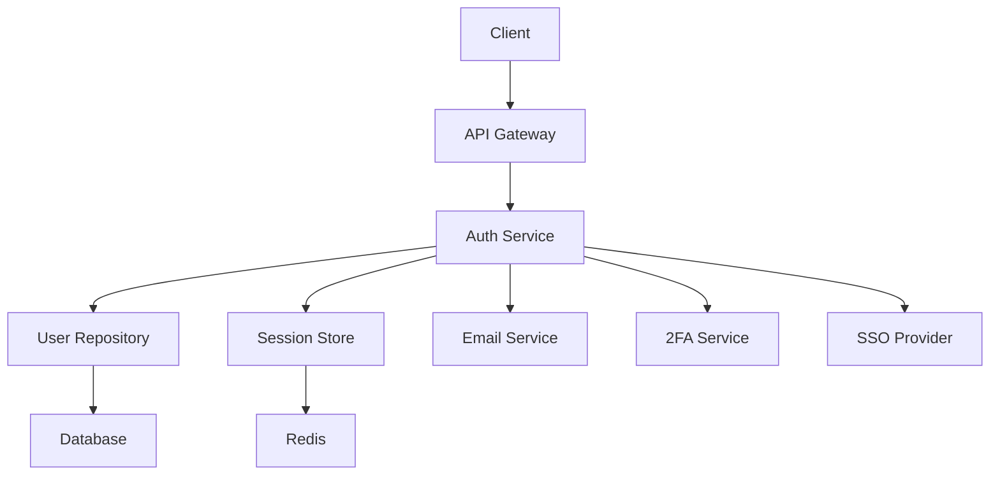

# 🔐 Authentication Module PRD

## 📋 1. Introducción y Objetivos

### **Propósito del Módulo**

El módulo de autenticación proporciona un sistema completo de autenticación y autorización para el template Alkitu, soportando múltiples métodos de autenticación según el nivel de licencia del usuario.

### **Objetivos Comerciales**

- **Escalabilidad**: Soportar desde usuarios individuales hasta empresas grandes
- **Flexibilidad**: Múltiples métodos de autenticación según necesidades
- **Seguridad**: Estándares de seguridad empresarial
- **Facilidad de uso**: Onboarding rápido y experiencia fluida

### **Metas Técnicas**

- **Performance**: <500ms tiempo de respuesta para login
- **Disponibilidad**: 99.9% uptime
- **Seguridad**: Zero vulnerabilities críticas
- **Escalabilidad**: Soportar 10,000+ usuarios concurrentes

---

## 👥 2. Stakeholders

### **Usuarios Finales**

- **Individuos**: Desarrolladores independientes y freelancers
- **Equipos pequeños**: Startups y pequeñas empresas (5-50 empleados)
- **Empresas grandes**: Organizaciones con 50+ empleados

### **Compradores**

- **CTOs**: Tomadores de decisiones técnicas
- **IT Managers**: Responsables de infraestructura
- **Security Officers**: Responsables de seguridad
- **Procurement**: Responsables de adquisiciones

### **Desarrolladores**

- **Frontend Developers**: Implementación de UI/UX
- **Backend Developers**: APIs y lógica de negocio
- **Mobile Developers**: Aplicaciones móviles
- **DevOps Engineers**: Despliegue y monitoreo

### **Partners**

- **System Integrators**: Integradores de sistemas
- **Resellers**: Revendedores del template
- **Consultants**: Consultores en implementación

---

## 📖 3. Historias de Usuario

### **Por Nivel de Licencia**

#### **Free Tier**

```gherkin
Como usuario individual
Quiero registrarme con email y contraseña
Para acceder a las funcionalidades básicas del sistema

Como usuario registrado
Quiero iniciar sesión de forma segura
Para acceder a mi cuenta personal

Como usuario que olvidó su contraseña
Quiero poder resetear mi contraseña
Para recuperar el acceso a mi cuenta
```

#### **Premium Tier**

```gherkin
Como usuario premium
Quiero activar autenticación de dos factores
Para aumentar la seguridad de mi cuenta

Como usuario premium
Quiero iniciar sesión con Google/GitHub
Para una experiencia más fluida

Como administrador de equipo
Quiero invitar usuarios a mi organización
Para colaborar en proyectos compartidos
```

#### **Enterprise Tier**

```gherkin
Como administrador empresarial
Quiero configurar SAML SSO
Para integrar con nuestro sistema de identidad corporativo

Como administrador de IT
Quiero sincronizar usuarios desde LDAP
Para mantener consistencia con Active Directory

Como security officer
Quiero configurar políticas de contraseña
Para cumplir con estándares de seguridad corporativos
```

### **Por Rol**

#### **Admin**

- Gestionar usuarios y permisos
- Configurar métodos de autenticación
- Acceder a logs de auditoría
- Establecer políticas de seguridad

#### **User**

- Registrarse y autenticarse
- Gestionar perfil personal
- Activar/desactivar 2FA
- Cambiar contraseña

#### **Developer**

- Acceder a APIs de autenticación
- Implementar custom flows
- Testear integraciones
- Acceder a documentación técnica

---

## 🎨 4. Características por Licencia

### **Free Tier ($0/mes)**

| Funcionalidad       | Incluido | Limitaciones     |
| ------------------- | -------- | ---------------- |
| Email/Password Auth | ✅       | Hasta 5 usuarios |
| Password Reset      | ✅       | Email básico     |
| Basic Profile       | ✅       | Campos limitados |
| Session Management  | ✅       | 1 sesión activa  |
| Basic API Access    | ✅       | 100 requests/día |

### **Premium Tier ($29/mes)**

| Funcionalidad     | Incluido | Limitaciones             |
| ----------------- | -------- | ------------------------ |
| Two-Factor Auth   | ✅       | SMS + TOTP               |
| Social Login      | ✅       | Google, GitHub, Facebook |
| Advanced Profile  | ✅       | Campos customizables     |
| Multiple Sessions | ✅       | 5 sesiones activas       |
| Enhanced API      | ✅       | 1,000 requests/día       |
| Team Management   | ✅       | Hasta 50 usuarios        |

### **Enterprise Tier ($99/mes)**

| Funcionalidad        | Incluido | Limitaciones            |
| -------------------- | -------- | ----------------------- |
| SAML SSO             | ✅       | Unlimited providers     |
| LDAP Integration     | ✅       | Multiple directories    |
| Advanced Permissions | ✅       | Role-based access       |
| Audit Logging        | ✅       | 1 año de retención      |
| Custom Policies      | ✅       | Password, session, etc. |
| Priority Support     | ✅       | 24/7 support            |
| Unlimited API        | ✅       | No rate limiting        |

---

## 🎨 5. Diseño y Experiencia del Usuario

### **Flujos de Usuario**

#### **Registro (Free)**

```
1. Landing Page → 2. Sign Up Form → 3. Email Verification → 4. Dashboard
```

#### **Login con 2FA (Premium)**

```
1. Login Form → 2. Password → 3. 2FA Code → 4. Dashboard
```

#### **SSO Login (Enterprise)**

```
1. Login Page → 2. SSO Provider → 3. Corporate Login → 4. Dashboard
```

### **Componentes UI**

- **Login Form**: Email/password, social buttons
- **Registration Form**: Progressive disclosure
- **2FA Setup**: QR code, backup codes
- **Profile Management**: Settings, security
- **Admin Panel**: User management, policies

### **Responsive Design**

- **Mobile First**: Optimizado para dispositivos móviles
- **Desktop**: Experiencia completa en desktop
- **Tablet**: Adaptación para tablets

### **Accesibilidad**

- **WCAG 2.1 AA**: Cumplimiento de estándares
- **Keyboard Navigation**: Navegación completa con teclado
- **Screen Reader**: Compatibilidad con lectores de pantalla
- **Color Contrast**: Contraste adecuado para visibilidad

---

## 🛠️ 6. Requisitos Técnicos

### **Backend (NestJS)**

```typescript
// Auth Module Structure
auth/
├── auth.controller.ts      # REST endpoints
├── auth.service.ts         # Business logic
├── auth.module.ts          # Module definition
├── strategies/
│   ├── jwt.strategy.ts     # JWT validation
│   ├── local.strategy.ts   # Local auth
│   └── saml.strategy.ts    # SAML SSO
├── guards/
│   ├── jwt-auth.guard.ts   # JWT guard
│   └── roles.guard.ts      # Role-based guard
└── dto/
    ├── login.dto.ts        # Login data
    └── register.dto.ts     # Registration data
```

### **Frontend (Next.js)**

```typescript
// Auth Components
components/auth/
├── LoginForm.tsx           # Login component
├── RegisterForm.tsx        # Registration component
├── TwoFactorSetup.tsx      # 2FA setup
├── ProfileSettings.tsx     # Profile management
└── SocialLogin.tsx         # Social auth buttons
```

### **Mobile (Flutter)**

```dart
// Auth Module
lib/auth/
├── auth_bloc.dart          # State management
├── auth_repository.dart    # Data layer
├── auth_service.dart       # API calls
└── screens/
    ├── login_screen.dart   # Login UI
    └── register_screen.dart # Registration UI
```

### **Database Schema**

```sql
-- Users Table
CREATE TABLE users (
  id UUID PRIMARY KEY,
  email VARCHAR(255) UNIQUE NOT NULL,
  password_hash VARCHAR(255),
  two_factor_enabled BOOLEAN DEFAULT FALSE,
  two_factor_secret VARCHAR(255),
  created_at TIMESTAMP DEFAULT NOW(),
  updated_at TIMESTAMP DEFAULT NOW()
);

-- Sessions Table
CREATE TABLE sessions (
  id UUID PRIMARY KEY,
  user_id UUID REFERENCES users(id),
  token VARCHAR(255) UNIQUE NOT NULL,
  expires_at TIMESTAMP NOT NULL,
  created_at TIMESTAMP DEFAULT NOW()
);
```

### **APIs**

```typescript
// Authentication Endpoints
POST /auth/register         # User registration
POST /auth/login           # User login
POST /auth/logout          # User logout
POST /auth/refresh         # Token refresh
POST /auth/forgot-password # Password reset
POST /auth/reset-password  # Password reset confirmation
GET  /auth/profile         # Get user profile
PUT  /auth/profile         # Update profile
POST /auth/2fa/enable      # Enable 2FA
POST /auth/2fa/verify      # Verify 2FA
```

---

## 📏 7. Criterios de Aceptación

### **Funcionalidades**

#### **Registro de Usuario**

- [ ] Usuario puede registrarse con email y contraseña
- [ ] Email de verificación enviado automáticamente
- [ ] Contraseña cumple políticas de seguridad
- [ ] Formulario valida datos en tiempo real
- [ ] Manejo de errores (email duplicado, etc.)

#### **Login de Usuario**

- [ ] Login con credenciales válidas exitoso
- [ ] Bloqueo después de intentos fallidos
- [ ] Sesión persiste según configuración
- [ ] Redirect a página solicitada post-login
- [ ] Logout limpia sesión completamente

#### **Autenticación de Dos Factores**

- [ ] Setup de 2FA genera QR code válido
- [ ] Códigos de backup generados y mostrados
- [ ] Verificación de código TOTP funciona
- [ ] Desactivación requiere confirmación
- [ ] Recovery con códigos de backup

#### **Integración SSO**

- [ ] Configuración SAML funciona correctamente
- [ ] Mapeo de atributos configurable
- [ ] Logout desde SSO cierra sesión local
- [ ] Errores de SSO manejados apropiadamente
- [ ] Múltiples proveedores soportados

### **Performance**

- [ ] Login response < 500ms
- [ ] Registration response < 1s
- [ ] SSO redirect < 2s
- [ ] API calls < 200ms
- [ ] Database queries optimizadas

### **Calidad**

- [ ] 95% code coverage
- [ ] 85% mutation score
- [ ] Zero vulnerabilities críticas
- [ ] Todas las pruebas unitarias pasan
- [ ] Pruebas de integración exitosas

### **Seguridad**

- [ ] Contraseñas hasheadas con bcrypt
- [ ] JWTs firmados y verificados
- [ ] Rate limiting implementado
- [ ] CORS configurado correctamente
- [ ] Headers de seguridad configurados

### **Usabilidad**

- [ ] Formularios user-friendly
- [ ] Mensajes de error claros
- [ ] Loading states apropiados
- [ ] Responsive en todos los dispositivos
- [ ] Accesible con teclado

---

## 🏗️ 8. Arquitectura Técnica

### **Diagrama de Arquitectura**



### **Patrones de Diseño**

- **Repository Pattern**: Abstracción de acceso a datos
- **Strategy Pattern**: Múltiples estrategias de autenticación
- **Factory Pattern**: Creación de tokens y sesiones
- **Observer Pattern**: Eventos de autenticación
- **Singleton Pattern**: Configuración global

### **Seguridad**

- **Password Hashing**: bcrypt con salt
- **JWT Tokens**: RS256 signing
- **Rate Limiting**: Redis-based
- **CORS**: Configurado por dominio
- **HTTPS**: Forced in production

---

## 📊 9. Métricas y Monitoreo

### **Métricas de Negocio**

- **Registration Rate**: Nuevos usuarios/día
- **Login Success Rate**: % logins exitosos
- **2FA Adoption**: % usuarios con 2FA
- **SSO Usage**: % empresas usando SSO
- **Session Duration**: Tiempo promedio de sesión

### **Métricas Técnicas**

- **Response Time**: P95 < 500ms
- **Error Rate**: < 0.1%
- **Uptime**: 99.9%
- **Database Queries**: < 100ms
- **Memory Usage**: < 512MB

### **Alertas**

- **High Error Rate**: > 1% en 5 minutos
- **Slow Response**: > 1s en 5 minutos
- **Failed Logins**: > 100 en 1 minuto
- **Database Issues**: Connection errors
- **Memory Pressure**: > 80% usage

---

## 🚀 10. Plan de Implementación

### **Timeline (20 días)**

#### **Semana 1: Fundación**

- **Días 1-2**: Arquitectura y diseño
- **Días 3-4**: Basic auth implementation
- **Días 5-7**: Testing y documentación

#### **Semana 2: Funcionalidades Premium**

- **Días 8-10**: Two-factor authentication
- **Días 11-12**: Social login
- **Días 13-14**: Team management

#### **Semana 3: Funcionalidades Enterprise**

- **Días 15-17**: SAML SSO
- **Días 18-19**: LDAP integration
- **Día 20**: Testing final y deployment

### **Dependencias**

- **User Management Module**: Para gestión de usuarios
- **Email Service**: Para verificación y notificaciones
- **Database**: Para persistencia de datos
- **Redis**: Para sesiones y rate limiting

### **Riesgos**

- **Complejidad SSO**: Integración con múltiples proveedores
- **Seguridad**: Vulnerabilidades de autenticación
- **Performance**: Latencia en autenticación
- **Compliance**: Cumplimiento de regulaciones

---

## 📚 11. Recursos y Referencias

### **Documentación Técnica**

- [JWT.io](https://jwt.io/) - JSON Web Tokens
- [Passport.js](http://www.passportjs.org/) - Authentication middleware
- [SAML 2.0](https://en.wikipedia.org/wiki/SAML_2.0) - SSO specification
- [TOTP RFC](https://tools.ietf.org/html/rfc6238) - Time-based OTP

### **Estándares de Seguridad**

- [OWASP Auth Guide](https://owasp.org/www-project-web-security-testing-guide/)
- [NIST Password Guidelines](https://pages.nist.gov/800-63-3/)
- [OAuth 2.0 Security](https://tools.ietf.org/html/rfc6819)

### **Competencia**

- **Auth0**: Plataforma de autenticación
- **Okta**: Identity management
- **Firebase Auth**: Google's auth solution
- **AWS Cognito**: Amazon's user management

### **Diseño y UX**

- [Figma Designs](https://figma.com/alkitu-auth)
- [User Journey Maps](https://miro.com/alkitu-auth-journey)
- [Usability Testing Results](https://docs.google.com/usability-results)

---

## ✅ 12. Checklist de Desarrollo

### **Antes de Empezar**

- [ ] Revisar PRD completo
- [ ] Confirmar dependencias
- [ ] Preparar ambiente de desarrollo
- [ ] Configurar testing infrastructure

### **Durante el Desarrollo**

- [ ] Implementar TDD
- [ ] Documentar decisiones técnicas
- [ ] Ejecutar mutation testing
- [ ] Actualizar documentación

### **Antes de Lanzar**

- [ ] Validar criterios de aceptación
- [ ] Ejecutar security audit
- [ ] Preparar documentación de usuario
- [ ] Configurar monitoreo

---

_Este PRD del módulo de autenticación está diseñado para ser implementado en 20 días utilizando arquitectura SOLID, TDD, y mutation testing, proporcionando una base sólida para el template comercial Alkitu._
